# Advent of Code 2025 day 1, but in AVR Assembly running on an ATTiny85

So here was the challenge:
- Solve Day 1 (preferably both parts) of Advent of Code 2025
- Using things I already have in my electronics parts bins that I find interesting
- In assembly

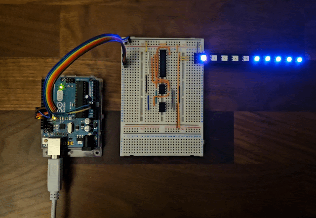

## Day 1 of Advent of Code 2025
The problem for day 1 had you emulate the dial on a safe. The dial has numbers 0 to 99 on it. You are then given a number of "moves" in the format `[LR][0-9]{1,3}`, or "L or R, followed by between 1 and 3 digits, inclusive". Moves are seperated by newline characters.

- Part 1: Count the number of times that, on completion of a move, the dial is on position 0.
- Part 2: Count the number of times that the dial lands on position 0, at all, including all transits across it.

This can be solved with a very small number of lines of python using modular arithmatic like this:
```
# part 1
for line in lines:
    direction_operation = int.__sub__ if line[0] == "L" else int.__add__
    magnitude = int(line[1:])
    current_digit = direction_operation(current_digit, updated_magnitude) % 100

    if current_digit == 0:
        zero_landings += 1

print("Zero landings: ", zero_landings)
```

## Picking the Processing
My parts organiser definitely contains more "processing" options than it probably should, including:
- Various flavours of Raspberry Pi Pico
- Multiple arduino boards, branded and otherwise
- A couple of Texas Instruments MSP430 evaluation boards
- A Softec Freescale HCS08 Starter kit board from back at university
- A Zilog Z84 PDIP microprocessor
- A couple of Atmel ATTiny85 microcontrollers
- Maybe 6 different flavours of ESP32 board

I decided to go with the ATTiny85 for this one as it would present some interesting challenges.
It is an 8-pin PDIP microcontroller from Atmel (now Microchip) with 8kb of program space, 512 bytes of RAM, 512 bytes of EEPROM, and an up to 20MHz clock speed, although we will be maxing out at 8MHz using the internal RC oscilator.

### Why do we have ATTiny85 Chips?
No idea. My email recipts tell me I bought them for £2.50 a piece back in 2012. I don't remember buying them and I dont remember what I thought I was going to do with them, but now I have 2.

## Picking how to get data in to this thing
People gets different input data for Advent of Code problems, and my input file for day 1 was 17.6 kb. There's no way thats fitting in the onboard EEPROM, or the program flash as a massive set of constants. First thought was some sort of encoding pass over the data to optimize it and maybe we could get it small enough. First thought was that each row could be 2 bytes. 4 bits for each of the digits since 0 to 9 fits in to 4 bits, then the remaining 4 bits could be for "direction" which only requires 1 bit but we would have 4 to spare.

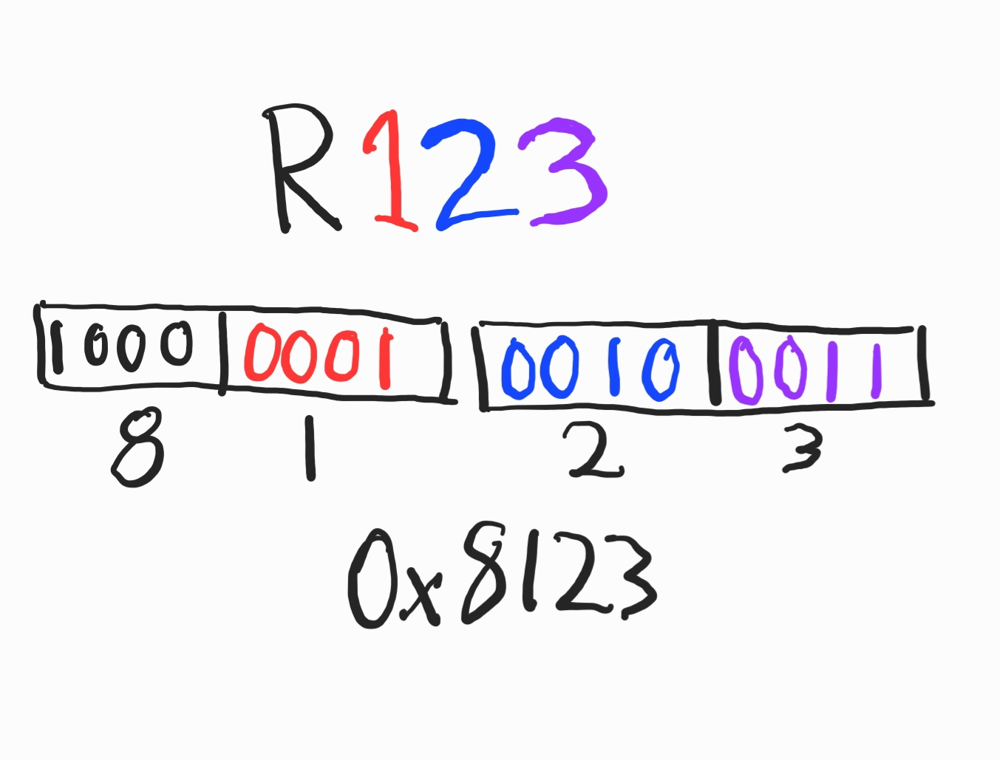

My input file is 4188 lines long. If we assume 2 bytes for each row, we're still looking at 8376 bytes, which is still larger than program memory. There may have been a way to encode this, maybe some sort of stream compression, but nothing was immediately jumping out to me.

Next idea was maybe I could use one of my Arduinos to read the input file from the computer over USB, and send that via SPI (serial-peripheral interface) to the ATTiny. 

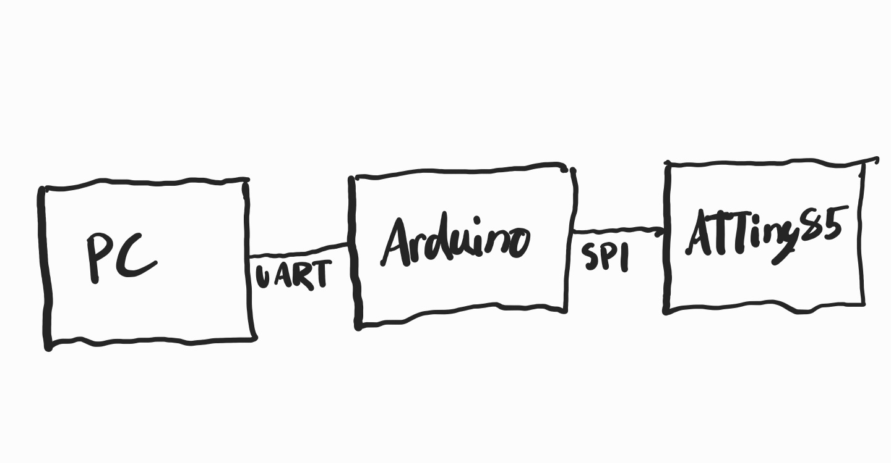

Really I just didnt like that idea. I'm sure its possible but in this hypothetical scenario where I have an Arduino available, which has 32kb of program flash, why would I not just run everything on that. No, in this case we're pretending that the only processing we have available to us is the ATTiny85.

What I finally landed on was another part I found in the parts bucket: the 25LC1024.

The 25LC1024 is a 1 megabit (128k x 8-bit, or 128 kilobyte) electrically-erasable read-only-memory, or EEPROM. What's interesting about this chip is that it is an SPI EEPROM. Instead of setting address pins and reading the value on the data pins like a traditional parallel ROM, you talk to this thing like an SPI peripheral where you send a read-command, send the address you want, and then it sends back the byte in that cell. Almost definitely slower than a parallel EEPROM but with a very low number of required pins: VCC, ground, and the 4 SPI pins. 

At 128kb we dont even need to do any optimization of the input file to make it fit, we just need a way to write the file. Thankfully we have a way, and that way is the MiniPro programmer which has support for the 25LC1024. We can just pass it a file and it will write it to the chip.

The ATTiny85 has an internal peripheral called "USI" or "universal serial interface" which we can use as a hardware SPI interface, preventing us from needing to bit-bang an SPI signal. The SPI EEPROM seems like a sensible choice.

### Why do we have 25LC1025 chips?
Looking back through my emails I see I requested it as a sample directly from Microchip. I asked for a 25LC1024 and a 23LC1024, where the 25 is a 1MBit SPI ROM and the 23 is a 1MBit SPI RAM, and they sent me 1 of each. No idea what I was planning on doing with these. Likely just testing Microchips sampling system when I was a student. 

## Picking how we get data out of this thing
The ATTiny does not have a convenient screen, or flashy lights, so we need to give it some. Keeping in mind we have exactly 6 pins we can use on this chip, and some are being used for the SPI signal that goes to the SPI EEPROM.

One approach for attaching large numbers of blinky lights to a pin-restricted device would be a pile of shift registers. I have a bunch of 74HC595 shift registers and we should only need a clock and data-in pin to get an arbitrary-length string of LEDs going. This was going to be a mess of wires and resistors though and thankfully I already something that could do that.

### The LED stick
There's an RGB LED called the WS2812, or the "NeoPixel".

They are insanely popular in the maker space. Using only VCC, Ground, and a data pin you can get an abitrary-length of LEDs to light up in whatever colour and pattern you want. They work by you sending structured commands over that data pin with a specific timing. Each LED has a data-out pin, which is chained to the next data-in pin, so you can just send out as many frames as you have LEDs.

You can get these in loads of form factors from individual breakout boards with a single LED on it, to multi-meter spools of the things. The one form-factor I do quite like and happen to have one of, is the "stick".

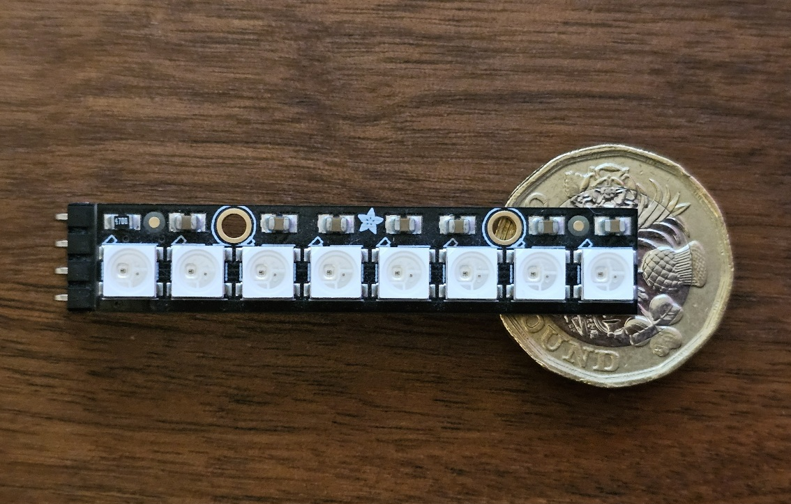

Adafruit offer this really nice form-factor which is just 8 LEDS on a PCB with a bit for you to solder wires or a header on.

However, NeoPixels annoy me slightly. The way they operate is that you need to send in a signal with a specific timing. If you're using the Adafruit neopixel library for Arduino then all is good, but I will not being using the arduino libraries. Thankfully, this behaviour irritated me a few years ago too, causing a search for a "better" RGB in the same "5050" size package. 

That's when I came across the "SK9822". The SK9822 is an RGB LED that you can talk to over SPI. Since it's SPI, we are in charge of the timing and can use standard SPI peripherals built in to microcontrollers to talk to it. This also coincided with a time where I was interested in lerning proper PCB design, so I fired up KiCad and managed to create a similar design to the Adafruit Neopixel stick, but for SK9822 LEDs, and with more generous space to get a soldering iron between the LEDs. Why does my design include 10 LEDs instead of a more-traditional 8? Can't remember.

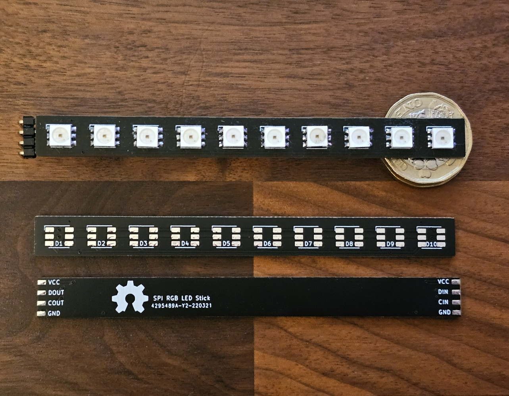

One thing with the SK9822 is that it doesnt have a "chip-enable" pin. In SPI, chip-enable pins allow the microcontroller to tell a specific external device that it should pay attention. In our example if we have both the SPI EEPROM and the stick of SPI LEDs attached to the SPI bus then every time we send commands to the SPI EEPROM, those commands are being sent to the SPI LEDs and potentially doing weird, unexpected things.

This meant that we needed to come up with a way to hide signals from the pixel stick since it had no capacity for us to tell it to stop listening. In theory, all we have to do is prevent the SPI clock signal from getting to the LEDs. If there's no clock signal then the LEDs take no action. There's probably a smart way to do this using a transistor as a gate, or some 74-series logic to build an AND-gate, but in the parts bucket I found a chip that should also work.

### The 74HC541N
The 74HC541N is an "non-inverting octal buffer". You have 8 input lines on one side, and have 8 output lines on the other side. There are two "output-enable" pins and if both of those are set low (active-low) then the input signal is replicated on the output. If either of the output-enable pins are "high" then the output become high-impedance. This meant we could pass the SPI clock and data lines in to the buffer, and then use the output-enable pins as a "chip-select" for the LEDs. If the output-enable pins are pulled low by the ATTiny85, the LEDs see the SPI signal, so we can talk to it. If the output-enable pins are pulled high by the ATTiny85, the LEDs never see either SPI signal. A lot of wasted breadboard space due to the large number of pins, but it works.

#### Why do you have the 74HC541N? 
I have 10 or more of them. Once upon a time I wanted to build a homebrew computer after becoming absolutely fascinated with the [Veronica 6502 by Quinn Dunki](https://hackaday.com/2012/01/04/backplane-and-mainboard-for-a-6502-computer/). On that machine 74HC541N chips are used as  gates for the address and data buses. I got as far as purchasing the Zilog Z80 I wanted to use as the processor and the pile of 74HC541N chips and no further. One day.

## Pulling it all together
With:
- the ATTiny85 as the CPU, and RAM
- The 25LC1024 as storage
- The 10 SK9822 LEDs (on the oposite side of an octal-buffer) as the output device

We now had a machine we could actually try running things on without too much frustration.
The schematic looks like this:
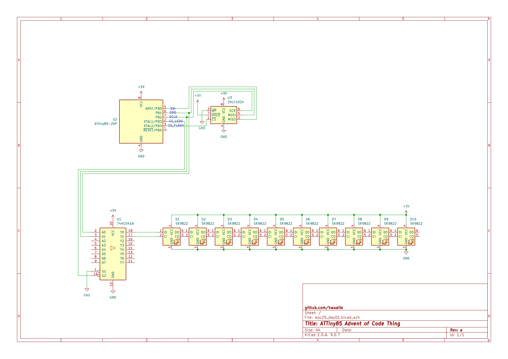

And built up on a breadboard it looks like this:
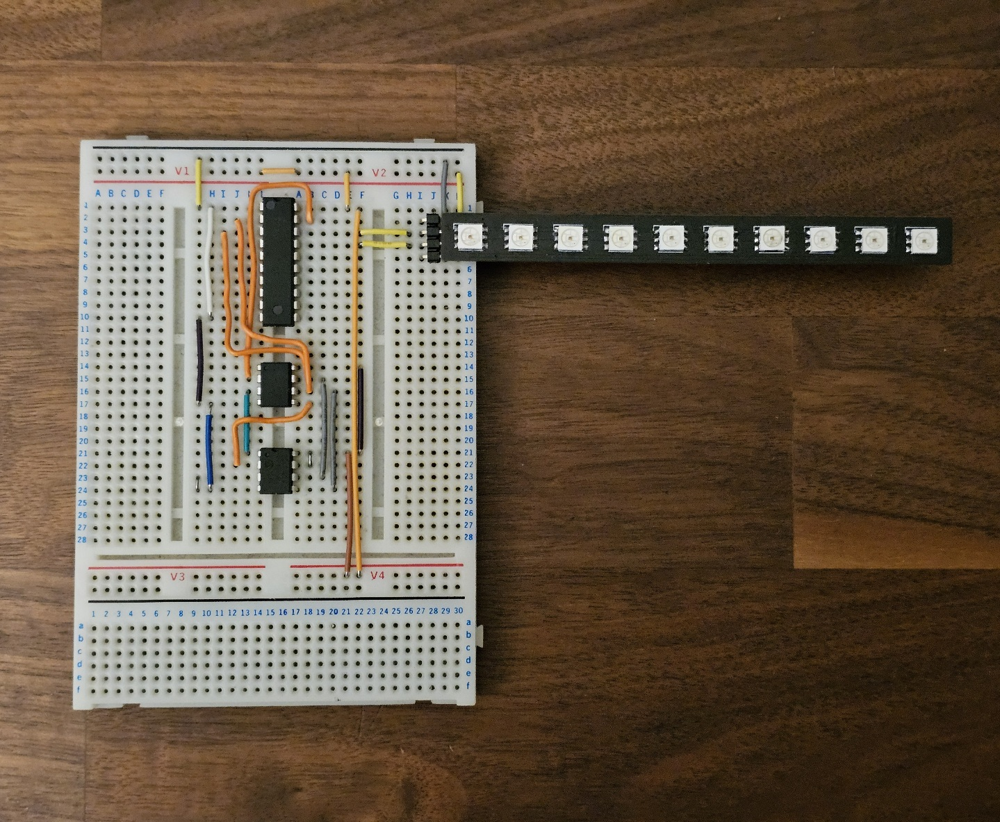

With the parts labelled:
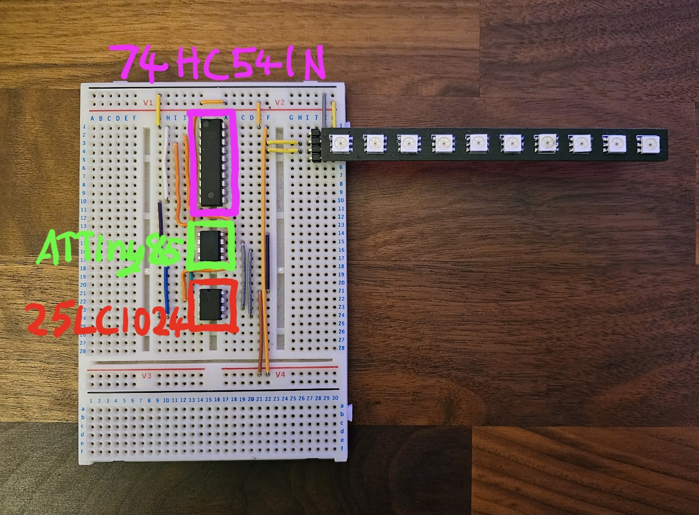

Before we can blink any LEDs though, we need a way to write code to the ATTiny85. If you're using an Arduino then you typically just press "upload" on the Arduino IDE and away you go. This works because the ATMega328P on the Arduino comes pre-installed with code that enables this, called the bootloader. Burning a bootloader to ATTiny is certainly an option, but I liked the idea of just burning raw hex files to the chip. The Minipro programmer has the ability to program an ATTiny85, but thats going to require pulling the chip from the breadboard every time we update the code, flashing the chip, and then pressing it back in to the board. That sounds like a recipe for breaking something.

Instead, we're going to use a thing called "ArduinoISP". ArduinoISP is a sketch included with the Arduino IDE, which you can burn to an Arduino device and then it will behave as a USB programmer for other chips. With this we can use the Linux "avrdude" program to program the ATTiny85 with a raw hex file, via the Arduino. This worked reasonably well. I'd say it had about an 80% success rate of writing to the ATTiny85, and I suspect that is because the programming pins are shared with the SPI bus pins connected to the LEDs and the SPI-EEPROM, so when it's sending programming commands, these peripherals could be the ones answering. Alternative theory is the poor contact on the reset pin capacitor as sometimes jiggling it about or discharging it helped. Unfortunately this setup also makes the breadboard a bit untidy.

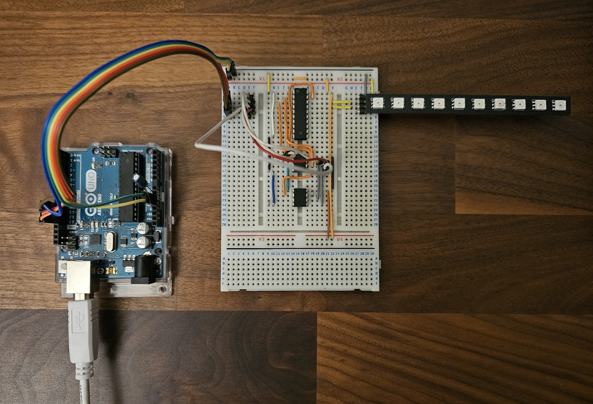
## Actually Writing Code

I did not know AVR assembly. I did have some experience of assembly but that was MIPS assembly and that was 15 years ago. As such, we needed to build this thing up incrementally. Here's the rough order of steps I took:

- Blink an LED
  - This was probably the biggest single jump. This was to validate:
    - that I could run an assembly file through avr-gcc to make a hex file
    - that I could write that hex to the chip via the Arduino
    - that the clock speed was set correctly by checking that what should be a 2 second delay is in fact a 2 second delay. Turns out clock was being divided by 8 in because of the fuses set so delays were all 8 times longer than they should have been.
- Light an LED on the SPI LED stick
  - This is the point where we needed to add a subroutine for talking to SPI devices. Thankfully, page 111 of the ATTiny85 datasheet just gives you the full subroutine.
- Write a byte in binary out on the SPI LED stick
  - excellent for debugging as at any point in the program I could now output the contents of a register
- Write a word in binary out on the SPI LED stick
  - I felt this was going to be needed to write the final answer of the problem to the LEDs
- Write an arbitrary RGB pattern on the whole SPI LED stick
  - At this point, everything I had been working on had been entirely within registers. I wanted to know how to set values in RAM, as well as reserve whole blocks of RAM for buffers. This let me set up a 5 byte buffer which could be used to set each LED to red, green, blue, yellow, magenta, cyan, white or off. 
- Read a byte from the SPI EEPROM and write that byte to the SPI LED stick
  - Next I needed to validate that I could actually pull values from the SPI EEPROM. This was simple as we already had the SPI subroutines and the EEPROM interface is not complex if all you want to do is read single bytes. It's just 0x03, the 24-bit address, and 0x00. There is a slightly fancier read mode where you just keep clocking 0x00 and it will auto-increment the address, however the chip-select must be held low the whole time, and I was wanting to write debug values to the LEDs, so just stuck with the standard single-byte method.
- Actually implement Day 01 of Advent of Code

## Advent of Code Day 01

### Part 1
At the point where I was starting to write the part 1 subroutine I still couldnt really from-scrath visualize how an assembly function was going to hang together, so I  but with limitations of the ATTiny85: no multiplication, no division, math through bitshifting, and working within tiny buffers. This was also the point where I decided to just go with the algorithm where we execute the number of ticks rather than trying to be clever with modulus. Dial moves would be much simler, using only `inc` and `dec` opcodes. I did identify an optimization where in part 1 you can actually completely ignore the hundredths digit as the dial is 100 positions, so 423 ticks is the same as 23 ticks, meaning at most we would need to tick 99 times.

The ATTiny offers X, Y, and Z registers which are 2 8-bit registers stuck together that can behave like individual 16-bit registers. The X register was used to hold the number of times we landed on the 0 dial position as it would almost definitely exceed 255, and the plan was to leave this in the X-register on completion so that the `write_word_to_leds` subroutine, which already takes its input from the X-register, could render the answer on the LED stick. The result looked like this: 
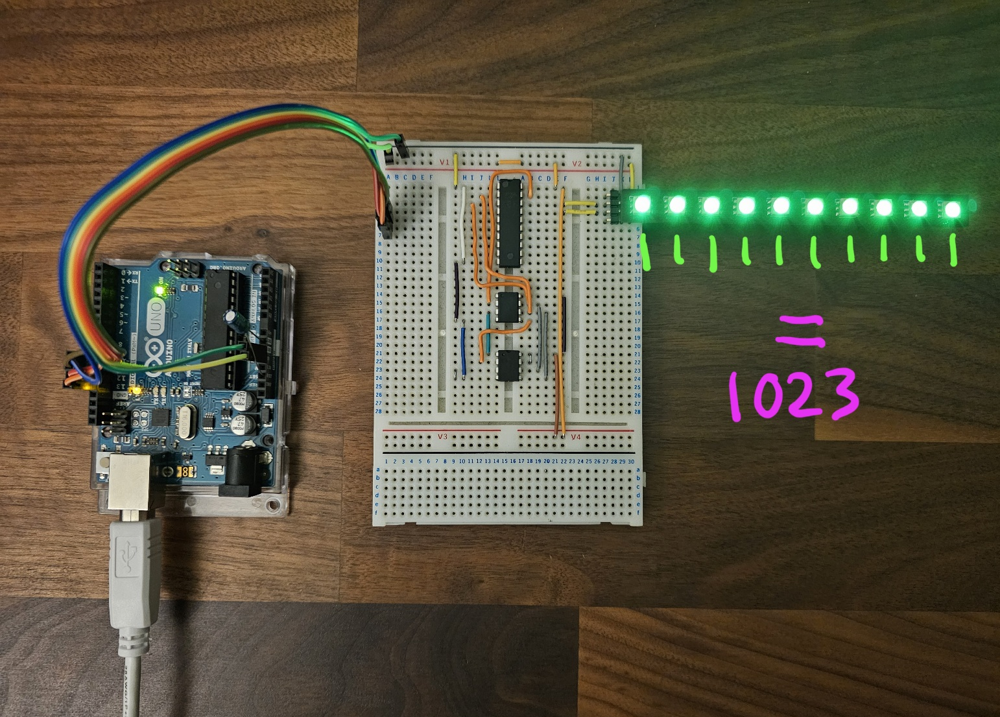

This is an unsatifying conclusion. Althought 0b1111111111 or 1023 IS the correct answer for my particular input file, it looks like it's broken and just lighting all LEDs. This also raises a problem for part 2. If the number of zero LANDINGS maxes out the display, then the number of zero CROSSINGS is absolutely going to overflow the 10-bits of the display.

Except that we havent hit max-capacity on the display. The `write_word_to_leds` subroutine only uses off and green to represent 0 and 1 as this was convenient for binary values. If we use off, red, green, and blue to represent digits then we can represent the result in base-4, or a maximum value of 1048575, far exceeding the 16-bit register limit of 32767. To represent the maximum 16-bit value of 0xFFFF we actually only need 8 of the LEDs, leaving 2 for other purposes.

I wrote a subroutine that would take the result of part 1 in the X-register, and convert it to a base-4 representation in the 5-byte RGB buffer in RAM. The first two LEDs could then be used to indicate if it is showing the result of the part 1 solution or the part 2 solution in purple.

Turns out the answer is also rather boring in base 4, but at least it doesnt fill the display:
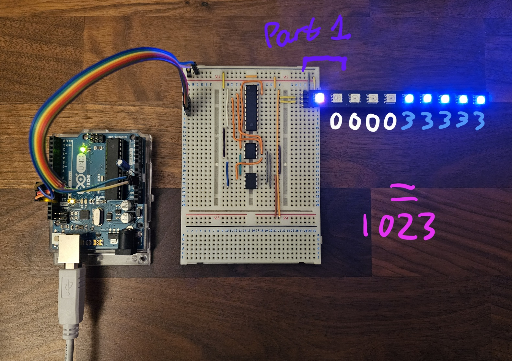

Thankfully, part 2 would look more interesting.

### Part 2
When you are just incrementally counting ticks for this problem the solution for part 2 becomes semi-trivial. On each tick check if you are on a 0 and increment a counter if you are. That's it. New problem: we have just run out of 16-bit registers to hold the number of zero crossings.

For part 1 we were using:
- X for holding the number of zero landings (the part 1 answer)
- Y for holding an index in to a buffer in RAM holding the current input line we are processing
- Z for holding the current address we are accessing in the EEPROM

X and Z needed to be 16-bit numbers, so I would have had to replace Y with an 8-bit register and unfortunately all the useful load and store opcodes want ot use X/Y/Z. This would mean we'd need to make a new 16-bit register. I went with r5 for the high-byte and r4 for the low-byte, matching the pattern used by the X/Y/Z registers where the high-byte goes in the higher-numbered register. We'd need some subroutines to work with the new 16-bit register: add and inc.

Add would end up looking like this:
```
add_pseudo_word:
  ; add the value of r6 to the pseudo 16-bit register of r5:r4
  add r4, r6
  brcc add_pseudo_word_no_carry
  inc r5 ; there was carry so inc high byte
add_pseudo_word_no_carry:
  ret
```

`brcc` is "branch if the carry-flag is cleared". If the result of adding r6 to r4 resulted in an 8-bit overflow then the carry-flag is set and we increment r5. Otherwise, dont bother incrementing r5. This worked as expected. My next problem was implementing the `inc_pseudo_word` subroutine:

```
inc_pseudo_word:
  ; inc the value of the pseudo 16-bit register of r5:r4
  inc r4
  brcc inc_pseudo_word_no_carry
  inc r5 ; there was carry so inc high byte
inc_pseudo_word_no_carry:
  ret
```

In theory this increments the low-byte, and if it overflows then we increment the high-byte just like the add operation. Same as the add operation but with even fewer input registers. Simple.

Incorrect. This would not play. I burned an hour on debugging this before resulting to copilot, which very quickly identified that my issue was that the `inc` opcode does not set the carry-flag on 8-bit overflow, so r5 was never incremented. Solution was the unsophisticated option of making a copy of the addition code but using a temporary register loaded with the literal value "1" as the second operand.

At this point we now have a subroute that will, upon completion:
- Have stored the number of zero landings in the X-register (part 1 answer)
- Have stored the number of zero crossings in the r5:r4 register pair (part 2 answers)

We already have the code for converting a 16-bit value to base 4 and showing it on the LEDs meaning the final main loop became this:
```
forever:
  ; write value of X to LED buffer
  ; set LEDs from buffer
  ; wait 5 seconds
  ; stash value of X
  ; move r5:r4 in to X
  ; write value of X to the LED buffer
  ; set LEDs from buffer
  ; wait 5 seconds
  ; restore original value of X
  ; jump to forever
```


## How Does it Run?

### Program Size
As of the 28th of January the assembled program uses a grand total of 658 bytes of the program flash
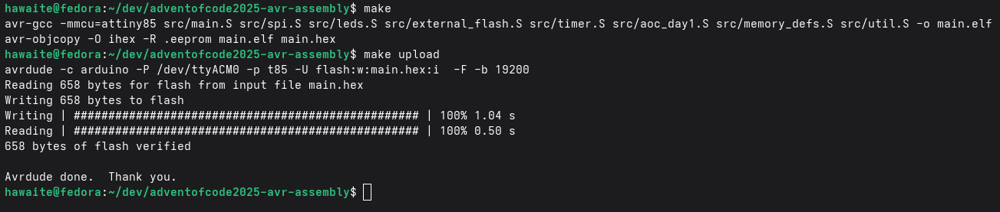

### RAM Usage
I managed to get away with only using 9 bytes of RAM:
- 5 bytes for a buffer representing the LED state
- 4 bytes to hold the current line read from the EEPROM

Fairly sure all of that could be moved to registers for a memory usage of 0 bytes.

### Execution Time

Finally I'd like to understand what the execution time and execution profile of this thing is. For this we can use the suspiciously-cheap 24MHz logic analyzer. With this we can listen in on the SPI lines to identify whats going on. The program manually clears the LEDs, immediately calculates the day 1 answers, and the sets the result on the LEDs, meaning calculation time is just the bit between the two LEDs communications. That's good enough granularity for this.

We can use pulseview to orchestrate the capture and then evaluate the captured trace:
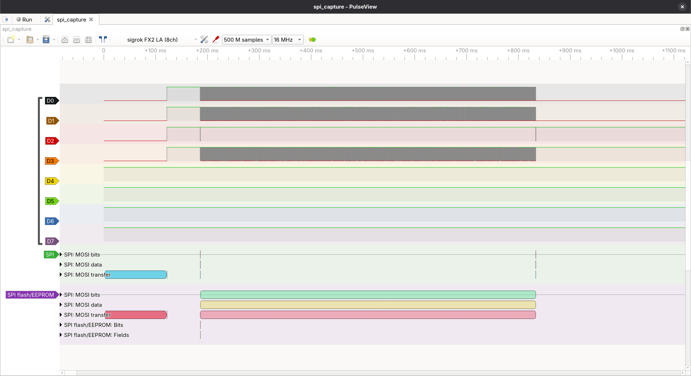

If we measure the time between the LED "clear" and the LED "set" signals we can see the rough execution time is 647ms:
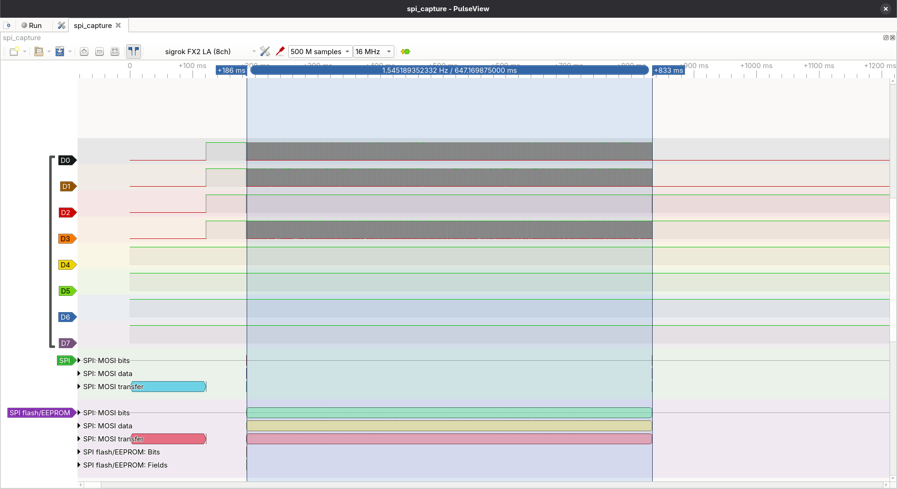

Would be good to know where all that execution time went as even though we went with an inefficient algorithm thats still slower than I would have guessed.

SPI clock was measured or having a frequency around 4MHz which is half of clock frequency, so not a problem of slow SPI clock.

We can see how long setting the LED pattern takes from the trace and see that its around 193 microseconds, or 2 tenths of a millisecond:
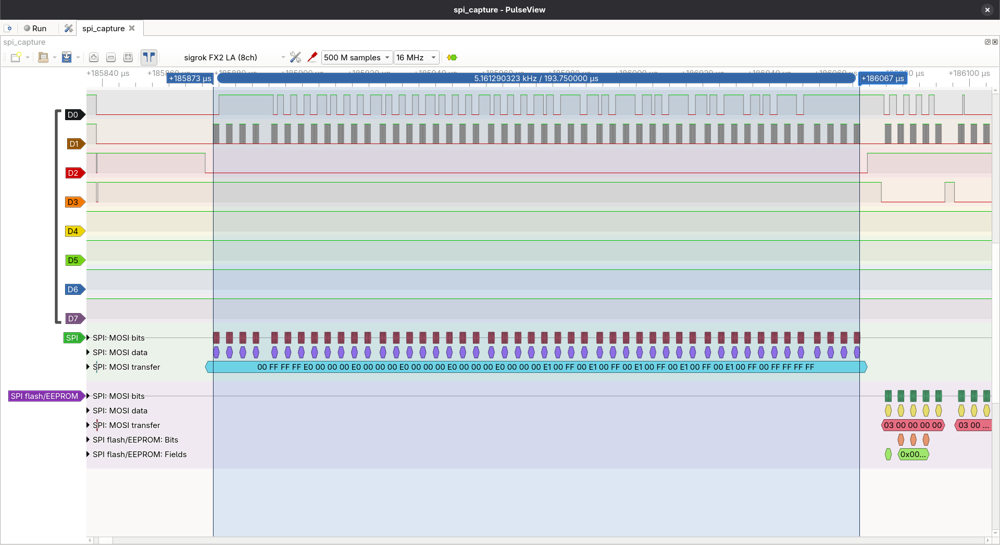

Also visible on this trace is that either:
- The program is wrong and sending `0x00 0xFF 0xFF 0xFF` as the LED stick 'start frame' when it should be `0x00 0x00 0x00 0x00` but for some reason it's still accepting it
- Something went wrong with the capture
- I did something incorrect in pulseview setup
- A little bit of all of the above

Something going wrong with the capture is less likely though as we can see that the EEPROM commands are being correctly decoded:
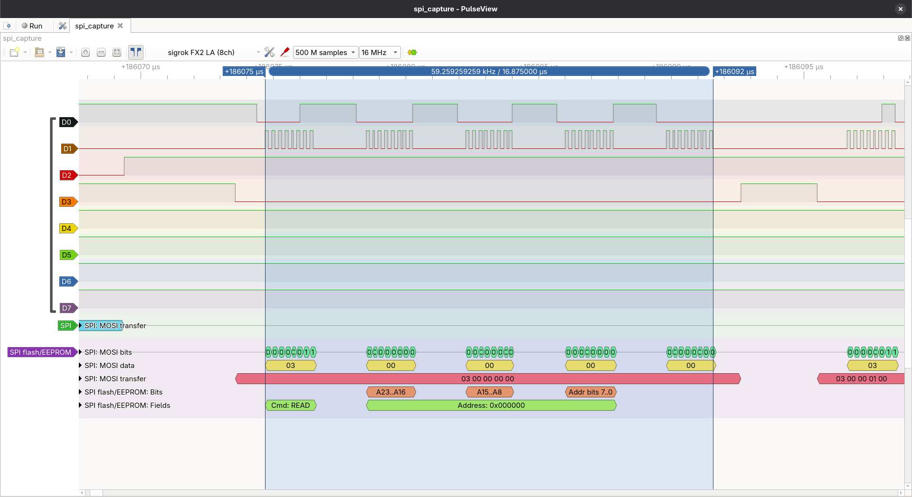

Here you can see the decoded `0x03 + 24-bit address` command which is taking around 17 microseconds to write out with the next read happening very soon after.
If we say that the program does absolutely nothing other than read bytes from the EEPROM, to read 17.2k characters from EEPROM at 17 microseconds a go would be 292ms. So almost exactly half the time spend reading from EEPROM and half the time actually doing processing.

Final observations can be found on this screenshot:
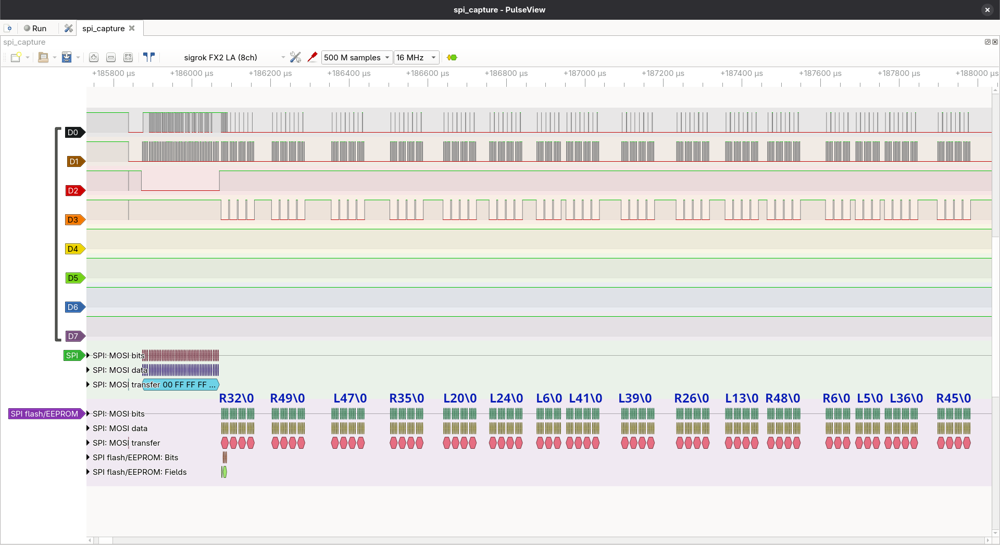

You can clearly see where the processing occurs in between the EEPROM fetches, meaning you can also see how many character it fetched before starting processing.

Another interesting observation, but obvious in hindsight, is that the processing time between the EEPROM blocks depends entirely on the number fetched. The gap after R32 is shorter than the gap after R49, and the gap after L6 is tiny. This is just because of the inefficient algorithm I chose where execution time is tied directly to the input number.

Good enough.